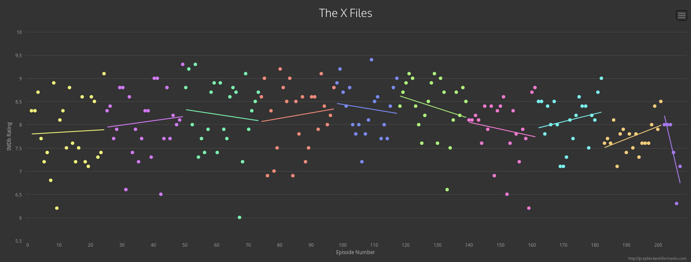

 (446.38 KB)

(09-12)

This is a semi-interactive visual that shows inter-state migration within the United States from 1900 to 2014. I like that it's capable of presenting a lot of information while still looking remarkably simple. It has two modes, and for each mode it shows details on the top states explicitly while grouping the remaining states by region (via color). A white "glue" is used to retain the shape while allowing paths to overlap (pretty clever, in my opinion) and the content is always in a sorted order.

https://www.nytimes.com/interactive/2014/08/13/upshot/where-people-in-each-state-were-born.html#Colorado

---

 (2.68 MB)

(09-13)

This map uses binning to represent population density. Though I don't like the color scheme and use of circles for binning (too much empty space compared to hexagonal binning) I do like their approach and implementation. They could have tried to represent other statistics in the map (like used color to represent the amount of infrastructure and create an interesting dialogue between population and infrastructure throughout the world) but instead they chose to represent density in more than one way in order to make it easier to read and really transmit that information well (country borders weren't implemented for similar reasons).

A short write-up of the visualization is available here:

https://fathom.info/notebook/1981/

---

 (1,015.52 KB)

(09-14)

This is actually a set of multiple visualizations that break down how different players score in the Miami Heat and San Antonio Spurs NBA teams (only a small sample were chosen for the image submitted). My initial instinct would be to use a heat map for this visualization instead of hexbins BUT after thinking about it I realized that their approach actually makes more sense because the rules of basketball create zones (in a natural way) and heat maps don't really convey that information well. I think this diagram serves as a good reminder that intimate knowledge about a topic may help one create a better visualization. That said, the legend placement, company logo, twitter watermark, comic book style typeface+speechbubbles, should all be either removed or reworked.

http://grantland.com/the-triangle/courtvision-how-the-heat-and-spurs-score/

---

 (2.53 MB)

Data Cuisine is an initiative that explores food as a medium for information visualization (via a series of workshops with different themes in different countries). I love everything about this project. The food isn't just used as the medium but also as an allegory that gives the viewer a more personal relationship with the information, though in some pieces this is more apparent than others. The end presentation is clear, whimsical yet professional, and beautifully executed. I only uploaded one picture from the project but they are all very much worth looking at.

http://data-cuisine.net/data-dishes/

---

 (1.52 MB)

(09-16)

The project allows a user to choose a github repository then based on the amount of code written in different languages it creates a visual representation. Each language is represented as a different layer (3D) and at the end it is run through a shader to render it as ascii (all via three.js). This is an artistic project and as such the visual representation isn't super useful (though arguably one can get a sense of the size of the repository among other things), the artist describes his intention more akin to Rorschach inkblot.

What I really like about this project is that the data isn't represented all at once, rather each user is able to generate visualizations about the repositories they care about. This creates a more personal relationship with the data and incentivizes sharing via social media. Such an approach may be applicable to certain visualization projects.

http://codeology.kunstu.com

---

 (394.39 KB)

(09-17)

A set of interactive and animated visualizations on several introductory statistics concepts.

http://students.brown.edu/seeing-theory/index.html

---

 (793.36 KB)

A family of programs that give a tree map visualization of disk usage. Individual files and folders are represented as rectangles (files are filled in with a color denoting the filetype while folders show contents as smaller rectangles). The original Linux program is called kdirstat (though the current version by the same author is qdirstat). A windows variant called WinDirStat (shown in picture) and Mac OS variant called Disk Inventory X also exist. The software is extremely useful for tracking down hard drive space usage and different variants support many extra features (eg. the Linux variant allows one to zoom into smaller folders with the mouse wheel and run commands like 'make clean' directly from the interface). There are other approaches to hard drive space visualization but imo few are as effective as this one.

https://en.wikipedia.org/wiki/WinDirStat

---

 (2 MB)

(09-19)

Gource is an animated tree based visualization tool. It's mainly intended to be used with repositories (eg. Git, SVN, Mercurial, Bazaar) but through its "custom log" feature it can visualize all sorts of data in interesting ways. The images provided are just individual frames from videos generated by gource (links to the videos are provided below). I really like the Olympic Games visualization, it shows a play by play and lets you see a nice overall breakdown for each year (not so effective at depicting country performance cumulatively however).

Since the tool wasn't meant to be used this way it has some quirks and limitations. Specifically things like node size, binning, and means to influence the layout of the tree are absent. As thus one should be aware that with some data sets the information can become so crowded that it can become difficult to interpret from different distances (perhaps this can be exploited to implement some hybrid-image visualization technique but currently I'm skeptical).

http://gource.io/

https://github.com/acaudwell/Gource/wiki/Custom-Log-Format

Videos used in image:

GCC

https://www.youtube.com/watch?v=ZEAlhVOZ8qQ

Filesystem changes

https://www.youtube.com/watch?v=InlfK8GQ-kM

Olympic Games

https://www.youtube.com/watch?v=n-8rRd_rATg

Google+ Activity

https://www.youtube.com/watch?v=3poNeQHUKrs

Population growth

https://www.youtube.com/watch?v=yh9IW9dXFQw

---

 (383.5 KB)

(09-20)

This family of visualization techniques (Hive Plot) is entirely new to me and it completely blew my mind. The approach seems reminiscent of the use of string diagrams in category theory (as opposed to the usual graph representation). Unfortunately the technique requires that the viewer be given an explanation on how to "read" the visualization, this makes it inappropriate for some situations (depending on the intended audience) but the result is beautiful nonetheless and arguably in some cases it's no worse than the (current) alternatives.

My poor understanding of the premise for the visualization is that cells contain a "transcriptional regulatory network" where DNA+Protein interactions act as inputs and Gene expressions as outputs (or side effects?). This functions, according to the authors of the research paper, analogous to the call graph for computer operating systems OS. So, the visualization aims to compare the network topologies of both E. Coli's transactional regulatory network and Linux's call graph, and does so effectively using several features of the Hive Plot technique. An explanation is provided on their page here:

http://www.hiveplot.com/talks/hiveplot-introduction.pdf

http://www.pnas.org/content/107/20/9186.full

http://www.hiveplot.com/

---

 (2.43 MB)

(09-21)

Byte plotting is a simple technique for visualizing binary data. A few clever people have used it to generate a lot of images (visualizations for lots of files) in order to run image classification or clustering algorithms on said images and deduce interesting things about the original files. The main application is malware recognition and classification (techniques vary, there's even a master's thesis where someone uses a convolutional neural net)! I think this unconventional use of information visualization presents some interesting questions and opportunities with regards to our perspective on information visualization. Perhaps we ought to explore the idea that information visualizations can themselves be information/data for other areas of data science. A few years ago I recall seeing a similar technique involving convolutional neural nets and visualizations of network topologies/configurations with applications in either network administration or cybersecurity; unfortunately after hours of searching I was unable to find any trace of it.

The malware variants visualizations are very interesting either way. There seems to be at least one person attempting to use bit plotting (each bit renders as a black or white pixel) but I'm not sure if other similar techniques are being taken advantage of.

Slides, paper, and website(s) on Malware detection using Byte Plots by Nataraj (and research lab).

http://vizsec.org/files/2011/Nataraj.pdf

https://dl-acm-org.ezproxy.lib.ucalgary.ca/citation.cfm?id=2016908

http://old.vision.ece.ucsb.edu/~lakshman/malware_images/album/

http://sarvamblog.blogspot.ca/

Thesis using CNN with Byte Plots by Gilbert (Chapter 5).

http://www.covert.io/research-papers/deep-learning-security/Convolutional%20Neural%20Networks%20for%20Malware%20Classification.pdf

Black Hat talks by Conti describing Byte Plots and several other binary visualization techniques (he wrote papers too but the talks and slides are way more informative).

http://www.blackhat.com/presentations/bh-usa-08/Conti_Dean/BH_US_08_Conti_Dean_Visual_Forensic_Analysis.pdf

https://media.blackhat.com/bh-usa-08/video/bh-us-08-Conti/black-hat-usa-08-conti-visualforensics-hires.m4v

https://media.blackhat.com/bh-us-10/presentations/Bratus_Conti/BlackHat-USA-2010-Bratus-Conti-Voyage-of-a-Reverser-slides.pdf

https://www.youtube.com/watch?v=h68VS7lsNfE

Wolff and Davis using Bit Plots with a convolutional neural net to aid in disassembling executables.

https://www.youtube.com/watch?v=LQh8dktQReI

---

 (380.07 KB)

(09-22)

The Institute for Health Metrics and Evaluation at the University of Washington maintains a lot of huge databases of health related information and tries to make it accessible to the public. They have a number of impressive visualizations on their page. "GBD Compare" is one such visualization. It is incredibly comprehensive and essentially acts as an interface to a bunch of databases (in my opinion). The first time using it one should hit the "Take tour" button on the left panel to get a basic understanding of how it works and what it's capable of. In addition to being super interactive and having a lot of visualizations for lots of data sets (that you can view and interact with in a lot of different ways) it also allows one to download a screenshot showing just the visualizations (no complicated interface) and csv files of the data being displayed. There's also a separate "GDB Results Tool" that allows one to directly query the system for visualizations and csv's. The image uploaded shows a tree map visualization on the bottom breaking down the number of years lost to different disabilities globally and the top map shows a choropleth map displaying rates of self harm (as selected in the tree map below) by country and this isn't even beginning to scratch the surface of what it can do.

https://vizhub.healthdata.org/gbd-compare/

http://ghdx.healthdata.org/gbd-results-tool

http://www.healthdata.org/results/data-visualizations

---

 (752.41 KB)

(09-23)

I like this visualization, both aesthetically and for it's approach (it's simple yet innovative). The visualization is somewhere between a word cloud, a timeline, and an edge-less graph but it seems to manage (at least in my opinion) to present more information more clearly than any of those techniques alone could have. i felt that the use of color and size was effective in comparing the two different data sets (weekly top 40 vs top 2000) and in general liked the found the color scheme pleasant and non-distracting (even the "Vinyl disk" figures didn't seem out of place).

An interactive version can be found here:

http://www.datasketch.es/december/code/nadieh/

---

 (663.01 KB)

(09-24)

An interesting approach to visualization. Though the data is ordered it doesn't try to give precise quantities. Rather it tries to convey a more "emotional" sense of what the data means (by using motion, color, size, etc.. as metaphors). For instance, a slow, sloppy, unbalanced/unsymmetric wobble carries certain connotations and in contrast to a fine, fast, consistent, symmetric wobble and together they make an ordered scale of sorts with some semantic data built in. A use case is presented where someone using an exercising app may get a better sense of where they're sitting by looking at this visual as opposed to seeing a bunch of quantities about calories, heart rates, durations, etc... it's also pretty.

http://www.ora.systems/

https://vimeo.com/176536783 - Health app demo.

---

 (1.27 MB)

(09-25)

This "visual logic" was created by Charles Sanders Peirce in the late 1800s but it was abandoned until 1964. Since then there have been a few variants and proponents but it is still largely unknown and modern approaches seem at odds with Peirce's original intentions. Specifically, Peirce created the system as a means of visualizing semantic information and not as a method of deduction. That said, in my image I only covered the bare basics of the technique specifically so that I could highlight Sun-Joo Shin's "reading techniques" whereby a visualization of a logical statement can be "read" in many different ways yielding many different equivalent sentences under symbolic logic (I would've drawn more but I found it weirdly hard to boil down and it took me many more hours than I could have imagined). I think this is a really interesting idea, having a visualization that can be read in multiple distinct ways and each reading yields a different computation with very little effort. It's my impression that typically one tries to avoid ambiguity in readings and avoid leaving any computations up to the reader.

Peirce's technique extends to propositional logic and modal logic (somewhat) and it has proof systems for each. However, in the 80s some computer scientists working on expert systems in Twente stumbled upon a much superior generalization of Peirce's technique (though they didn't realize this till much later) called "Knowledge Graphs". Their technique not only implements all of Peirce's visual logics but they've actually developed a variant for capturing semantic and syntactic information from natural language sentences as visualizations (which can be boiled down into visualizations capturing concepts that can be recombined into new visualizations of concepts/sentences via a graph grammer)!!! I may use that for another journal entry (if I can figure out a way to simply draw and explain it).

---

 (730.18 KB)

(09-26)

This image was taken from the Mapping issue of the now defunct dANDelion magazine that used to be published here at UofC. Contrary to the name, "Mapping issue", the content itself is very eclectic (it uses a very generalized definition of map) and is somewhat ergodic. As such, despite owning the issue, I don't know much about the image other than it seems to be a piece of visual art from a magazine section themed around the +15 walkways in Calgary. The artist, Tyler Hayden went on to write, Ohmhole, apparently a book set in a dystopian future where everyone is HIV positive and technology is horrible; so maybe it's related to that?

All that said, this image stands out to me. The most obvious feature is that it re-interprets the +15 walkway as a schematic circuit diagram (the train and c-train are shown as well using custom notation). Other aesthetic features I think help create a "drafting" theme are the use of grid paper, use of and choice of stencil lettering (similar to drafting typefaces), and the circular frame. The Bow River is shown in its normal state but it's an iconic landmark so I think it aids the readability of the map (helps viewers establish scale and location). The image doesn't transmit any more information than a normal +15 map would and it is more difficult to read. Yet, I've certainly looked at it far more intently than I have any ordinary +15 map.

Info about the issue:

https://dandelionmag.wordpress.com/issues/37-1-mapping/

---

 (158.98 KB)

(09-27)

I love these types of visualizations. This one in particular is useful, simple, and clever.

http://setosa.io/blog/2014/08/03/csv-fingerprints/

https://github.com/setosa/csv-fingerprint

---

 (2.67 MB)

(09-28)

A group of brain researchers created this visualization that attempts to map language semantics to different points on the brain. The data came from fMRI scans of 7 subjects as they sat through a number of stories. RGB was chosen after reducing the dimensions of the data space to 985 via principal component analysis (this performed similarly to word2vec, apparently) and then to 4 by ruling out insignificant dimensions that could be explained by noise, and finally 3 after seeing that on one subject one dimension wasn't significant. Words were clustered (into 12 clusters) in the data space (4 dimensional version) via k-means and then labeled by hand.

Four visualizations are shown. The main one (powered by PyCortex) shows the brain as a 3D object that one can interact with (selecting points on the surface or moving the camera). There are options for transforming the layout to either smooth out the surface or flatten it to 2D and options for changing the data shown (either significance accross subjects or into regions). On the bottom left there's a second visualization displaying the 12 word clusters in the 4 dimensional space with RGB coloring (radius is 4th dimension). The third visualization on the bottom right lists uses a word cloud to show information about the currently selected voxel (with individual colors and an averaged color). Finally the fourth visualization appears over the word cloud and uses a "phone signal" logo to show how reliable the selected voxel's data is accross subjects (this was cute).

3D visualizations are difficult to pull off but this is an example where I think 3D is not only easier to understand but it conveys the data better than 2D (though for non-interactive print versions the flattened 2D version is probably preferable). While word clouds seem to be hated in the datavis community I think they were effective here since the data is fuzzy (i.e. prominence is more important to convey than quantities or proportions). Overall I think it's a beautiful visualization and I love everything about it, it even includes a tour.

Visualization:

http://gallantlab.org/huth2016/
Research paper:

http://www.nature.com/nature/journal/v532/n7600/full/nature17637.html

---

 (124.72 KB)

(09-29)

These visualizations were created by the MGH/Harvard-UCLA consortium (one of the two consortiums that are working on the Human Connectome Project). They're very stunning and a good example of a visualization that really only works in 3D.

http://www.humanconnectomeproject.org/gallery/

---

 (472.2 KB)

(09-30)

A physical visualization project created for a contest whereby users would cast votes via tweets. Each tweet/vote for a contestent was visualized by a drop of liquid being issued to their corresponding test tube. Even though at the end of the day they're really just making a bar chart it still seems very novel and engaging.

http://domesticstreamers.com/case-study/drip-by-tweet/

---

 (303.73 KB)

(10-01)

This is a visualization of smells around a New York city block. It is part of an PhD candidate's effort to represent (visually and otherwise) sensory information in urban environments.

http://sensorymaps.com/portfolio/nyc-thresholds-of-smell-greenwich-village/

http://sensorymaps.com/wp-content/uploads/2014/03/SensoryCities_%C2%A92015KateMcLeanV2.pdf

https://www.rca.ac.uk/research-innovation/research/student-research/research-students/kate-mclean/

---

 (411.5 KB)

(10-02)

This is a fun project where foot traffic in a University is visualized in an interesting way. Buildings floors are interpretted as "organisms" made up of room "cells" and corridor "cells". People are represented as molecules based on occupation, gender, age, and number of years at the university. Rooms change sizes in accordance to the number of people within them and corridors react to people passing through. The visualization is generated live from the universities schedule data and is displayed on 30 screens throughout campus. The purpose of the visualization is to remind everyone that they are each part of a much larger "organism".

http://variable.io/ucc-organism/

---

 (84.64 KB)

(10-03)

Here is a visualization technique shown in the appendix of "Parallel coordinates: Visual Multidimensional Geometry and its Applications" by Alfred Inselberg. The section in question was written by Yoav Yaari (there are more illustrations present as well).

A complex function is visualized via two parallel (complex) planes. I think the really interesting innovations are:

1. A horizon/infinity point is added
2. The lines are drawn in such a way that an underlying structure is revealed.
3. The individual data points don't really matter (in fact they aren't even labeled) but rather the overall structure does.

The author expands on the technique a little more in the text but I feel like one could incorporate infinity points/planes at the other end to visualize the Julia set of the function as well. As far as I'm aware there doesn't seem to exist any other related work on the technique.

Though it's used here for complex numbers the idea of representing structure via the empty space between the planes (or lines) may be applicable to other areas of information visualization.

---

 (3.29 MB)

(10-04)

This is a circos plot showing breast cancer genomic information. Per my understanding the visual is read from outside in with human chromosomes on the outside ring and insertions/deletions and rearrangements represented on each ring as you look further inwards. Some bar charts are shown on the sides and overall it's a very pleasing visual (color choices and all). Upon a quick glance one can not only get a sense of how many alterations there are in the genome but one can also identify phenomena like chromothripsis ("big" rearrangements). Though the technique is common to cancer research (among many others), circos plots are used for many different types of data.

http://cancer.sanger.ac.uk/cosmic/sample/genomes

https://www.ncbi.nlm.nih.gov/pmc/articles/PMC3706894/

http://circos.ca/intro/published_images/

---

 (1.17 MB)

(10-05)

Jorinde Voigt is an artist whose earlier work focused on taking real world data and visualizing it using an abstruse system of rules and notation with a focus on representing semantic data like space and speed (her newer work is more abstract). That said, I don't classify this as data visualization since it's so unusual. Still, I very much like her work, especially how it's able to draw one's eye despite being so chaotic.

http://jorindevoigt.com/blog/?cat=560

http://jorindevoigt.com/blog/?cat=565

http://jorindevoigt.com/blog/?cat=177

http://jorindevoigt.com/blog/?cat=261

---

 (161.95 KB)

(10-06)

This visualization is from the Allen Brain Observatory project, a project by the Allen Institute for Brain Science that makes available a lot of data collected in-vivo from the mouse visual cortex.

Here a cell (neuron) is observed while 118 images are presented 50 times each in random order. Each image is represented by a bar on the corona and each dot is a recording of the stimulus. The darkness of the dot references the strength of the reaction and the dots are sorted so that the darkest are nearest the center of the corona. This effectively gives a fingerprint for the cell and allows one to quickly compare many cells at once and to make observations about how the cell reacts to different stimulus. A mouseover shows the image represented by a given bar.

I like this visualization very much. It's simple, easy to read, doesn't require color to work, and doesn't clutter the visual with data (the goal is to compare large differences between neurons, not small ones). Also, since the bars don't have thickness like normal radial bar charts then there's no distortion in volume (where the bars get thicker further out). This visualization inspired my approach to project 2 after I decided against parallel coordinates.

http://observatory.brain-map.org/visualcoding/stimulus/natural_scenes

---

 (153.72 KB)

(10-07)

These two visualizations are also from the Allen Brain Observatory project (they make a lot of custom innovative visualizations). I'm submitting them together because they are very similar. The star plot captures 3 dimensional data while the fan plot captures 4 dimensional data and they're each well fitted to their purpose. They also come with short explanatory videos (linked below). Though I like these visualizations and think they're very clever, they are very specific to their dataset (specifically orientation) so it may not be feasible to apply the same techniques to different types of data.

http://observatory.brain-map.org/visualcoding/stimulus/drifting_gratings

https://www.youtube.com/watch?v=kfVppO6M95k

http://observatory.brain-map.org/visualcoding/stimulus/static_gratings

https://www.youtube.com/watch?v=a-Ze1uuj33k

---

 (43.78 KB)

(10-08)

Graph TV isn't really innovative or even out of the ordinary. It simply takes a TV series from IMDB and shows its rating as a scatter plot with a trend line for the season (plus options for a series trendline and axis scaling). Despite that Graph TV is far more informative and useful than any visualization you'll find on IMDB, not to mention it's simplicity makes it familiar and easy to use quickly (no explanation required). I think it's a great example of a case where a visualization doesn't have to be groundbreaking to be great. It's also an example of a visualization so reasonable that it makes one question why it isn't part of IMDB in the first place!

http://graphtv.kevinformatics.com/tt0106179

---

 (1.42 MB)

(10-09)

A visualization that represents Arxiv papers as particles with size dependent on the number of citations and clusters based on citations and references. On the face of it the idea seems similar to a packed bubble chart but the forces here create empty space which make the data much easier to read and navigate. The search feature also does a clever thing where each search result is highlighted by a large surrounding circle that can be selected (so you don't have to zoom in to click on a result).

http://paperscape.org/

---

 (134.01 KB)

This is a re-implementation of Minard's famous Napoleon map. The main thing to note is the use of a moving gradient in order to represent movement (see link below; broken in Firefox, difficult to see in uploaded image).

https://bl.ocks.org/nbremer/raw/a6690ca67800a2abafcd71ef4725f33f/

Nadieh Bremer shows some more examples here.

https://www.visualcinnamon.com/2016/05/animate-gradient-imitate-flow-d3.html

The technique can be used to make visualizations more readable or to add another dimension to the data (eg. showing if a bar in a bar chart is on an upward/downward trend). It seems that getting a cross-browser solution working isn't as easy as it sounds.

---

 (801.5 KB)

This is a 'knowledge graph' visualization of the 'semantic structure' of a natural language sentence. Explaining it is quite complicated. Essentially it is an attempt at capturing concepts visually (via graph theory) in such a way that they:

1. Correspond to natural language syntax
2. Can be combined with other concepts
3. Can be used to reason with

The general technique was developed in the 80s by a group of computer scientists working on expert systems at the University of Twente. Unfortunately it has had very little activity since then (and has perhaps been abandoned after the recent death of the main researcher). Knowledge graphs in general can be used to implement many systems including formal logics (in a slightly more sophisticated way to C.S. Peirce's existential graphs).

The best references are two PhD Dissertations written simultaneously. The first covers all the mathematical formalism behind Knowledge Graphs and implements several formal logics (Knowledge Graphs and Logic: One of Two Kinds by Harmen van den Berg) and the second details the application to natural language and semantics (Chemistry of Language by mark Willems). This image was taken from the latter text.

---

 (4.26 MB)

Back in 2013 Douglas Crockford (one of the most influential people in the Javascript world) proposed an alternative to syntax highlighting (commonly termed context coloring or scope coloring).  The idea is that code is colored based on the scope level it's in and variable/function calls are colored based on the scope level they were declared. This way one can more easily keep track of where they are (especially in Javascript where callbacks and anonymous functions are commonplace) and what they're calling. Though there were a few text editor plugins (partially) implemented the idea never fully caught on.

Syntax highlighting is so commonplace that I doubt many think of it as information visualization but I'd argue otherwise. Effectively it's a means of visualizing certain properties about a body of code. Context coloring only changes the properties that one is visualizing. I'm curious if there's an opportunity to go further. One may attempt to visualize semantic data (though maybe only practical in a domain specific language) or one may build even more totally different visualizations into the text editor (beyond mere color). There are likely many other areas too where we have learned to take the standard visualizations for granted and forgotten to wonder about what else can be done.

---

 (669.31 KB)

Kai Chang is a big proponent of parallel coordinates and he has made some visualizations on USDA nutrition data using them. I was skeptical at first but the visualization is easy and pleasant to use.

http://bl.ocks.org/syntagmatic/raw/3150059/

There is another version of the visualization with 146 parallel coordinates that is not as easy or pleasant but it's also not as bad as I pictured.

http://bl.ocks.org/syntagmatic/raw/3290392/

He's also done a talk where he goes over these visualizations amongst others. Most notably he mentions some interesting ways to think about parallel coordinates. Seeing his talk convinced me not to use parallel coordinates for project 2 due to the similarity between data sets.

https://www.youtube.com/watch?v=ypc7Ul9LkxA

---

 (508.22 KB)

(10-14)

Here's a paper describing a technique for creating rows of parallel coordinates such that every pair of coordinates appears adjacent exactly once. The top left diagram shows a typical scatter plot matrix, the top right shows a parallel coordinate version, the bottom left shows our goal which is like the top right but with redundant comparisons removed. The bottom right is the trick to how it's done (each coordinate is represented as a node in a complete graph and decomposing said graph into Hamiltonian paths gives us our solutions):

http://www.joules.de/files/heinrich_parallel_2012.pdf

Clearer explanation of hamiltonian decomposition algorithm:

http://zulko.github.io/blog/2013/11/08/placing-your-employees-so-that-everyone-meets/#thanksGoogle

The only drawback is that the decomposition may look arbitrary to a viewer.

---

 (840.29 KB)

(10-15)

The image shows Cayley graphs for a few different groups (abstract algebra), more interestingly the graphs are drawn as polyhedra which emphasizes their relationship to the symmetries of said polyhedra. The textbook is Nathan Carter's Visual Group Theory, it covers a few other useful visualizations besides Cayley graphs as well. Nathan Carter also created a program called Group Explorer to accompany the text, it allows people to view and interact with several visualizations of groups but unfortunately it is terribly unmaintained (though there seems to be interest in rewriting it for the web).

---

 (308.13 KB)

(10-16)

Here data was gathered from seven runners for a week using activity trackers (Nike Fuelband). For each runner, each day was visualized as a separate branch where their activity influenced the shape, height, and thickness of the branch (the intention being that each branch is meant to act as a metaphor for muscle fibers, hence the name). Looking at each runner's final visual one can get a sense of how consistent their days were, their record activity, etc.. and are even able to compare different runners.

The visualization leans on the more artistic side of things but it still conveys the information it wants to convey and it does so in a fun quasi-personal sort of way.

http://variable.io/fibers/

---

 (149.41 KB)

(10-17)

This is a visualization that fingerprints films. Unlike other film fingerprinting visualizations this one breaks the film down to dvd chapters and visualizes motion on screen as motion in the visualization. It's novel and straightforward (also there's a short video explaining the visualization on the developer's site).

http://cinemetrics.site/

http://cinemetrics.fredericbrodbeck.de/

---

 (828.6 KB)

(10-18)

One of the visualizations at the 9/11 memorial created by Local Projects (arguably the others aren't really visualizations due to their use of space and sound). The visualization pulls data out of a database to generate 'timelines' of events that have a significant relationship to 9/11 as well as the present (i.e. attempting to show how 9/11 affects our present).  Due to the implementation the visualization is capable of drawing insights that the creators and others may not have expected it to.

https://www.youtube.com/watch?v=e9CHVEheqlo

---

 (21.67 KB)

(10-19)

Here's a FiveThirtyEight visualization that combines data from several sources (primarily the CDC) on gun deaths. It uses discrete units in the visualization but small enough that they read as a single large blob. I think the visualization is very effective at representing proportions and aside from their use of color I think it's fairly well done.

https://fivethirtyeight.com/features/gun-deaths/

---

 (1.33 MB)

(10-20)

A visualization that charts 1538 genres using Spotify data. The visualization looks plain and rough at first glance but its real power lies in its interactivity. Clicking on a genre will play music of that type, and clicking on the chevrons to the right of each genre will take you to a cluster visualization of several bands classified under it (you can also navigate via the search bar if you like). I think more could be done on the visual side but to be honest the current setup isn't all that bad.

http://everynoise.com/engenremap.html

---

 (1.3 MB)

(10-21)

An interactive visualization showing every fight in a long TV series. I think the visualization is very easy to read and especially liked that the designer chose to represent changes in story arc by shifting the vertical line to the right, it's simple but effective!

http://www.datasketch.es/january/code/nadieh/

---

 (1.23 MB)

(10-22)

A 2012 visualization of the Corruption Perception Index by Studio Terp. It's essentially a scatter plot with corruption on the x-axis and countries on the y-axis but through it's sorted y-axis, multiple data points per country, and general style and layout it comes off much fancier. Using different size circles to represent a time scale is something that I would be skeptical to try but in their case it looks well.

http://www.studioterp.nl/corruption-perception-index-2012-a-datavisualization-by-studio-terp/

---

 (1.01 MB)

(10-23)

A visualization of rainfall in Eindhoven over a timespan of 25 years. Each year is broken down into months and each month is represented by overlapping circles representing the amount of rain fall for each day. I love the color palette in this image and I think it's really clever how they represented the months so that they look like ripples from drops of water (assuming that was intentional as I have a hard time believing it's not).

http://www.studioterp.nl/rain-drops-a-datavisualization-by-studio-terp/

---

 (1,007.79 KB)

(10-24)

A visualization showing a breakdown of artists who contributed to charity songs. Each artist's links are annotated with the capacity in which they participated on that song (eg. solo, collective, etc..), the number of songs worked on is shown, and collaboration is also represented, among lots of other data. It's actually a pretty robust set of visualizations that simultaneously present a lot of information and aren't difficult to read.

http://www.studioterp.nl/voices-that-care/

---

 (34.81 KB)

(10-25)

An old project from 2008 that used SVD to classify blogs as left/right leaning and then (via a greasemonkey script) visualized the data on a news aggregater named memeorandum. It's simple and clearly conveys what it sets out to convey. I'm sure better results could be achieved nowadays if one wished to try something similar (especially considering they did it by just using SVD).
